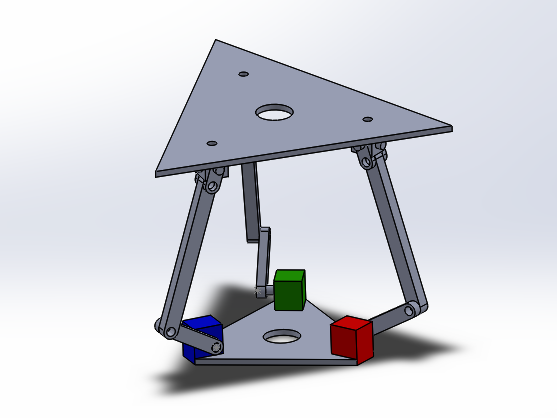
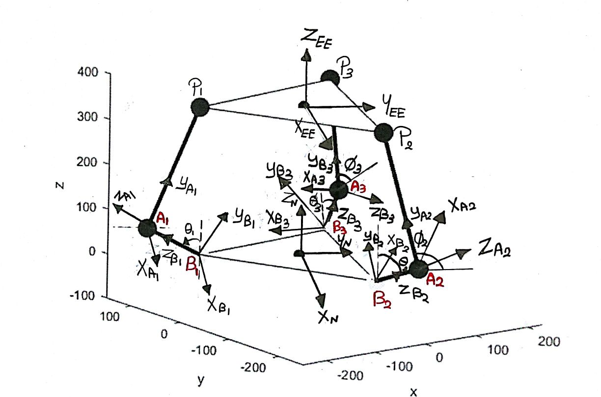
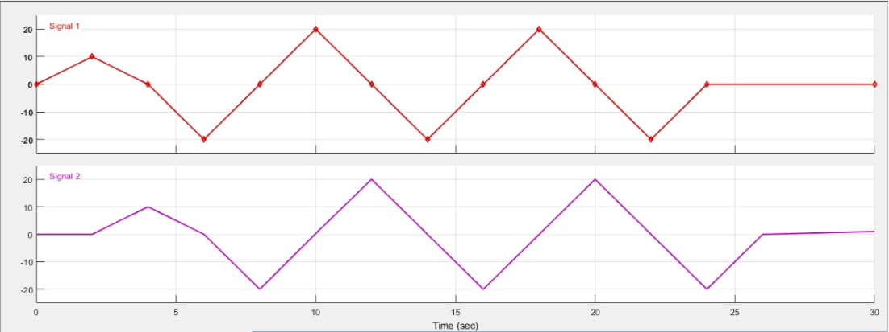
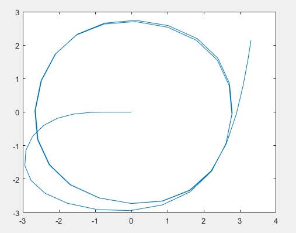
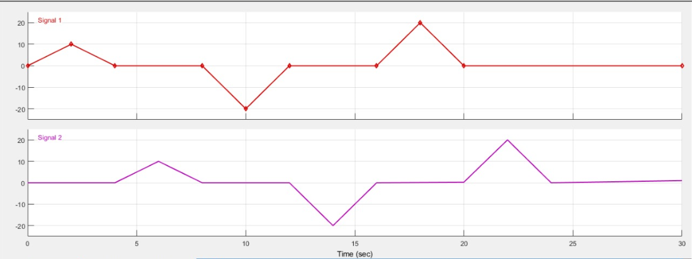
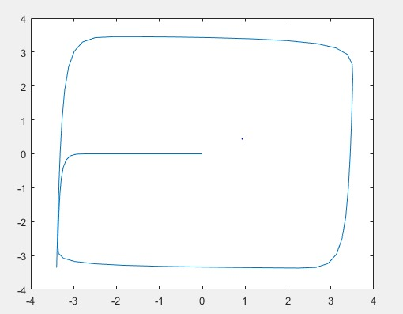

> Information Technology Institute
>
> Motion Simulator
>
> Robotics
>
> Israa Ahmed Merhan Wael Mohamed Omar
>
> Submitted to Eng. Omar Shehata
>
> May 9, 2018
>
> Contents
>
> 1 Introduction 2
>
> 2 Robot Kinematics 3
>
> 3 Kinematics Of 3-DOF Parallel Robot 5 3.1 Forward Position Kinematics
> . . . . . . . . . . . . . . . . . . . 5 3.1.1 Vector loop equations: .
> . . . . . . . . . . . . . . . . . 5
>
> 3.1.2 Rotation Matrices . . . . . . . . . . . . . . . . . . . . . 5
> 3.1.3 EE Position Equations . . . . . . . . . . . . . . . . . . 8
> 3.1.4 Constrain Equations . . . . . . . . . . . . . . . . . . . 8
>
> 3.2 Solid-Work Model Verification . . . . . . . . . . . . . . . . . . 9
> 3.3 Inverse Position Kinematics . . . . . . . . . . . . . . . . . . .
> 10 3.3.1 Orientation Equations . . . . . . . . . . . . . . . . . . 10
> 3.3.2 Passive angle equations . . . . . . . . . . . . . . . . . . 11
> 3.3.3 Position Equations . . . . . . . . . . . . . . . . . . . . 11
>
> 4 Forward Velocity Kinematics 12
>
> 5 Inverse Velocity Kinematics 13 5.1 Constrain equations
> differentiation . . . . . . . . . . . . . . . 13 5.2 EE position
> equations differentiation . . . . . . . . . . . . . . 13
>
> 6 Simulation 14 6.1 Trajectory Planning . . . . . . . . . . . . . . .
> . . . . . . . . 14 6.1.1 Circular Trajectory . . . . . . . . . . . . .
> . . . . . . . 15
>
> 6.1.2 Rectangular Trajectory . . . . . . . . . . . . . . . . . . 16
>
> 7 References 17
>
> 1

> 1 Introduction
>
> This project aims to design and manufacture a 3-DOF motion simulator
> plat-form. It is divided into three main parts : modelling, mechanical
> design and control.
>
> Motion simulators are used to simulate virtual motion into real life,
> for exam-ple they are used in flight and car simulators to test
> aircrafts or cars or even to practice flying an airplane before being
> in an actual one. Another usage of motion simulators which is the
> topic of this project is game simulation, for example imagine that you
> play a car-racing game while sitting on this platform you will
> experience the feeling of being inside the game.
>
> Figure 1: Solidworks model
>
> 2

> 2 Robot Kinematics
>
> Our motion simulator can be described as a parallel manipulator with
> 3-DOF, two rotational motions (roll and pitch) and one translational
> motion in direction of Z-axis. The robot consists of 3 legs connected
> together through a platform, each leg consists of 2 links connected
> together through a revolute joint, each leg is connected to a motor
> through a revolute joint and to the platform through a U-joint.
>
> The kinematics problem of parallel manipulators is very tedious so we
> de-cided to simplify our problem by treating this robot as 3 serial
> robotic arms connected together through the platform which will be the
> work space of our robot, these fixation points are fixed in position
> forming an equilateral triangle and finally we neglected the presence
> of the U-joint but added the orientation of platform to our
> calculations. The motor axes of rotation are fixed at 120 rotated from
> each other creating an equilateral triangle.
>
> Setting 2 coordinate systems for each link and the base frame. In the
> median of the base triangle the Newtonian frame XNYNZN is selected and
> this is the fixed coordinate system. Z-axis in the fixed frame is
> vertically
>
> 3
>
> upwards, X-axes of the frames at motor points are co-linear with the
> axes of rotation of the motors and the x-axis of the Newtonian frame
> is parallel to the axis of the first coordinate system of the first
> motor(B1). 0s are the 3 active angles of our system created by
> rotating about (Xi) and it is between the vertical axis of the base
> frame (ZN) and (ZBi) (ZB1 is coincident with
>
> the link BiAi) . is are the 3 passive angles created by rotating about
> (Xi) and they are measured between (YN) and (YAi) (YAi is coincident
> with the link AiPi).
>
> 4
>
> 3 Kinematics Of 3-DOF Parallel Robot
>
> 3.1 Forward Position Kinematics 3.1.1 Vector loop equations:
>
> Link(1):
>
> Link(2):
>
> Link(3):
>
> jrOE = -ljYN +l1jZB1 +l2jYA1 (1)

jrOE = ljXN + 2 l 3jYN +l1jZB2 +l2jYA2 (2)

> rOE = -ljXN + 2 l 3jYN +l1jZB3 +l2jYA3 (3)
>
> 3.1.2 Rotation Matrices
>
> Link(1):
>
> 2 1 0 NRB1 = 4 0 cos1
>
> 0 sin1

0 3 -sin1 5,

> cos1

2 1 0 NRA1 = 4 0 cos1

> 0 sin1

0 3 -sin1 5

> cos1
>
> 5
>
> Link(2):
>
> 2 cos -sin 0 3 NRB21 = 4 cos -sin 0 5,
>
> 0 0 1
>
> 1 0 0 A21RA2 = 4 0 cos2 -sin2 5,
>
> 0 sin2 cos2
>
> cos -cos2 sin sin2 sin NRB2 = sin cos2 cos -sin2 cos
>
> 1 0 0
>
> cos -cos2 sin sin2 sin NRA2 = sin cos2 cos -sin2 cos
>
> 1 0 0
>
> 2 1 0 B21RB2 = 4 0 cos2
>
> 0 sin2
>
> NRA21 = NRB21

3

5

> 3
>
> 5

0 3 -sin2 5

> cos2
>
> Link(3):
>
> 2 cos2 -sin2 0 3 NRB31 = 4 cos2 -sin2 0 5,
>
> 0 0 1
>
> 1 0 0 A31RA3 = 4 0 cos3 -sin3 5,
>
> 0 sin3 cos3
>
> cos2 -cos3 sin2 sin3 sin2 NRB3 = sin2 cos3 cos2 -sin3 cos2
>
> 1 0 0
>
> cos2 -cos3 sin2 sin3 sin2 NRA3 = sin2 cos3 cos2 -sin3 cos2
>
> 1 0 0
>
> 2 1 0 B31RB3 = 4 0 cos3
>
> 0 sin3
>
> NRA31 = NRB31

3

5

> 3
>
> 5

0 3 -sin3 5

> cos3
>
> 6
>
> Link 1: Where :
>
> ZB1 = -sin1jYN +cos1jZN (4) YA1 = cos1jYN +sin1jZN (5)
>
> Final Calculations:
>
> XP1 = 0
>
> YP1 = <u>-l</u> -l1 sin1 +l2 cos1
>
> ZP1 = l1 cos1 +l2 sin1
>
> Link 2: Where :
>
> ZB2 = sin sin2jXN -cos sin2jYN +cos2jZN (6) YA2 = sin sin2jXN
> -cossin2jYN +cos2jZN (7)
>
> Final Calculations:
>
> XP2 = <u>l</u> +l1 sin sin2 -l2 cos2 sin
>
> YP2 = 2 <u>l</u> 3 -l1 sin2 cos +l2 cos2 cos ZP2 = l1 cos2 +l2 sin2
>
> Link 3: Where :
>
> ZB3 = sin(2 )sin3jXN -cos(2 )sin3jYN +cos3jZN (8) YA3 = -sin(2
> )cos3jXN -cos(2 )cos3jYN +cos3jZN (9)
>
> 7
>
> Final Calculations:
>
> XP3 = <u>-l</u> +l1 sin(2 )sin3 -l2 cos3 sin(2 )
>
> YP3 = 2 <u>l</u> 3 -l1 sin3 cos(2 )+l2 cos3 cos(2 ) ZP2 = l1 cos3 +l2
> sin3
>
> 3.1.3 EE Position Equations
>
> The EE point is the median of the triangle connecting the 3-edges of
> the 3-Links.
>
> XEE = Xp1 +Xp2 +Xp3 (10)
>
> YEE = Yp1 +Yp2 +Yp3 (11)
>
> ZEE = Zp1 +Zp2 +Zp3 (12)
>
> 3.1.4 Constrain Equations
>
> The constrain Equation of this robot is that any distance between any
> two edges is constant and it is equal to the length of the triangle
> that connects the 3-edges.
>
> So the constrain equations are :
>
> ~~q~~
>
> C1 = (Xp1 -Xp2)2 +(Yp1 -Yp2)2 +(Zp1 -Zp2)2 (13)
>
> ~~q~~
>
> C2 = (Xp1 -Xp3)2 +(Yp1 -Yp3)2 +(Zp1 -Zp3)2 (14)
>
> ~~q~~
>
> C3 = (Xp3 -Xp2)2 +(Yp3 -Yp2)2 +(Zp3 -Zp2)2 (15)
>
> Where
>
> C1 = C2 = C3 = d (16)
>
> Where d is the length of the triangle.
>
> By solving the 3-previous equations using Newton Raphson , the passive
> angles 0s can be obtained.
>
> Applying 0s and 0s in the Vector Loop equations , the positions of the
> 3-edges and EE can be obtained.
>
> 8
>
> 3.2 Solid-Work Model Verification
>
> Comparsion

||
||
||

||
||
||

||
||
||

||
||
||

82 76.63 82.8 80.63 77.47 83.746

||
||
||

||
||
||

||
||
||

88.86 88.86 88.69 90.85 90.85 90.85

||
||
||

||
||
||

||
||
||

68.244 68.244 68.244 69.98 69.98 69.98

||
||
||

||
||
||

||
||
||

69.45 84.32 74.63 69.76 85.73 75.78

||
||
||

> Table 1: Model Verification
>
> 9
>
> 3.3 Inverse Position Kinematics 3.3.1 Orientation Equations
>
> Due to the platform orientation around x-axis and y-axis (Pitch and
> Roll) , the position of 3-edges of the triangle can be obtained as a
> function in the EE position and the platform orientation ( and ).
>
> is the angle due to the orientation around x-axis of the fixed frame.
>
> is the angle due to the orientation around y-axis of the fixed frame.
>
> 10
>
> 3.3.2 Passive angle equations
>
> Zpi = f(,) (17)
>
> The previous equation shows that 0s function in 0s and Zpi. So the
> equations will be:
>
> Link(1):
>
> Link(2):
>
> Link(3):

1 = sin-1(Zp1 -l1cos(1)) (18) 2

2 = sin-1(Zp2 -l1cos(2)) (19) 2

3 = sin-1(Zp3 -l1cos(3)) (20) 2

> 3.3.3 Position Equations
>
> -l -l1 sin1 +l2 cos1 -YP1 = 0 (21)
>
> 2 l 3 -l1 sin2 cos +l2 cos2 cos -YP2 = 0 (22) 2 l 3 -l1 sin3 cos(2
> )+l2 cos3 cos(2 )-YP3 = 0 (23)
>
> by substituting equations 18,19,20 in equations 21,22,23 ,we can get
> the 0s and 0s.
>
> 11
>
> 4 Forward Velocity Kinematics
>
> In order to solve the velocity kinematics problem, the velocity of the
> end effector must be found using the angular speed of the motors as the
> input. After differentiating the constraint equations using the
> following equations :
>
> @C1 @C1 @i @C1 @i @t @i @t @i @t
>
> @C2 @C2 @i @C2 @i @t @i @t @i @t @C3 @C3 @i @C3 @i
>
> @t @i @t @i @t

\(24\)

\(25\)

\(26\)

> Now these equations become 3 linear equations in 0s (passive angles’
> angular velocities) because in these equations the end effector
> position, mo-tor angles and passive angles are givens to these
> equations , by solving them together we obtain 0s . Now it’s necessary
> to differentiate the end effector position equations for each link in
> order to obtain the velocity of the end effector of the whole platform.
>
> As,
>
> XEE = Xp1 +Xp2 +Xp3 (27)
>
> YEE = Yp1 +Yp2 +Yp3 (28)
>
> ZEE = Zp1 +Zp2 +Zp3 (29)
>
> 12
>
> 5 Inverse Velocity Kinematics
>
> The inverse velocity kinematic problem can be solved by getting the
> values of angular velocity (i).
>
> By differentiating the EE position equations and the constrain
> equations w.r.t and .
>
> 5.1 Constrain equations differentiation
>
> @C1 @C1 @i @C1 @i @t @i @t @i @t @C2 @C2 @i @C2 @i @t @i @t @i @t @C3
> @C3 @i @C3 @i @t @i @t @i @t
>
> 5.2 EE position equations differentiation

\(30\)

\(31\)

\(32\)

> @XEE 1 @(Xp1 +Xp2 +Xp3)@i @(Xp1 +Xp2 +Xp3)@i @t 3 @i @t @i @t
>
> @YEE 1 @(Yp1 +Yp2 +Yp3)@i @(Yp1 +Yp2 +Yp3)@i @t 3 @i @t @i @t
>
> @ZEE 1 @(Zp1 +Zp2 +Zp3)@i @(Zp1 +Zp2 +Zp3)@i @t 3 @i @t @i @t

\(33\)

\(34\)

\(35\)

> Where XEE , YEE and ZEE are the input to the inverse velocity
> kinematic problem . So, by solving this 6-equations using fsolve
> function , i and i can be obtained.
>
> 13
>
> 6 Simulation
>
> 6.1 Trajectory Planning
>
> In this section it is supposed to simulate the motion of a ball on the
> plat-form using the robot kinematics. In order to simulate the ball
> motion, the differential equations describing the ball motion is added
> to the rest of the system’s equation.
>
> a1 dtx + dt a2 +a3 dt+xdt 2 = -gsin (36)
>
> 2 2
>
> a1 dt2 + dt a2 +a3 dt +y dt = -gsin (37)
>
> As,
>
> a1 = 1+ mb(rb)2 a2 = mbrb
>
> Where,

a3 = Kcx b

> mb is the ball mass.
>
> rb is the ball radius.
>
> Jb is the moment of inertia of the ball.
>
> Kb is the coefficient of friction of the ball.
>
> By changing the orientation of the platform (by changing values of & )
> with respect to time in order to set a rectangular and a circular
> trajectories for the ball then solving the previous equations for
> these inputs to specify the position of the ball on the plate.
>
> 14

> 6.1.1 Circular Trajectory
>
> System Input Signal:
>
> Figure 2: Orientation angles input
>
> Path:
>
> Figure 3: Circular trajectory
>
> 15

> 6.1.2 Rectangular Trajectory
>
> System Input Signal:
>
> Figure 4: Orientation angles input
>
> Path:
>
> Figure 5: Rectangle trajectory
>
> 16
>
> 7 References
>
> 1\. An Upper Limb Rehabilitation Robot Based on 3-RRC Parallel
> Mech-anism Hongbo Wang, Ning Du, Huina Hou, Jiangshun Zhao and
> Hong-nian Yu,Proceedings of the 2012 International Conference on
> Advanced Mechatronic Systems, Tokyo, Japan, September 18-21,2012.
>
> 2\. Kinematics and dynamics analysis of a three degree-of-freedom
> paral-lel manipulator LIU Shan-zeng, ZHU Zhen-cai, SUN Zhao-peng, CAO
> Guo-hua School of Mechanical and Electrical Engineering, China
> Uni-versity of Mining and Technology, Xuzhou 221116, China Central
> South University Press and Springer-Verlag Berlin Heidelberg 2014,J.
> Cent. South Univ. (2014).
>
> 3\. Modelling of Ball and Plate System Based on First Principle Model
> and Optimal Control František Dušek, Daniel Honc, Rahul Sharma K.
> Department of Process Control, Faculty of Electrical Engineering and
> Informatics University of Pardubice nám. Čs. legií 565, 532 10
> Par-dubice, Czech Republic frantisek.dusek@upce.cz,
> daniel.honc@upce.cz, rahul.sharma@student.upce.cz, 2017 21st
> International Conference on Process Control (PC) June 6–9, 2017,
> Štrbské Pleso, Slovakia.
>
> 17
